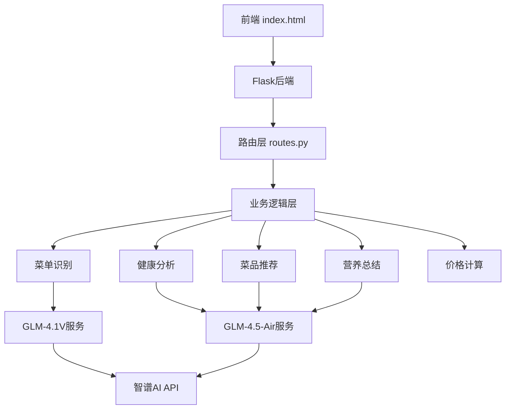
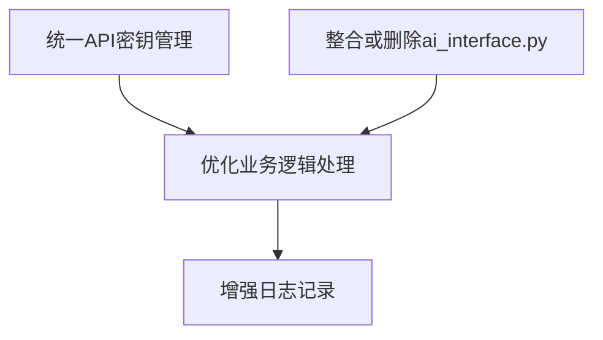

# Align (对齐阶段)

## 项目和任务特性规范

### 原始需求
1. 开发一个健康菜单推荐系统，后端基于Flask
2. 系统需要接收用户上传的菜单图片
3. 使用AI识别菜单内容
4. 分析菜品营养成分
5. 根据健康程度推荐菜品
6. 计算推荐菜品总价
7. 生成营养总结报告

### 边界确认
- 任务范围限于后端API开发
- 前端界面已通过index.html实现
- 项目使用Flask作为Web框架
- 使用GLM系列API进行AI功能实现
- 需要处理菜单识别、营养分析、菜品推荐、营养总结和价格计算等业务逻辑

### 需求理解
- 项目结构清晰，分为路由、业务逻辑和服务层
- 配置通过config.py和.env文件管理
- 使用了Flask蓝图来组织路由
- 通过GLM-4.1V API处理图片识别任务
- 通过GLM-4.5-Air API处理文本分析任务（营养分析、推荐、总结）
- 各业务模块相对独立，便于维护和扩展

### 疑问澄清
- 当前代码中的API密钥在多个文件中硬编码，需要统一管理
- ai_interface.py文件似乎未被使用，是否需要删除或整合？
- 部分业务逻辑处理可以进一步优化，提高代码健壮性

# Architect (架构阶段)

## 系统分层设计

### 整体架构

### 分层设计和核心组件
- 表示层: 静态HTML页面 (index.html)
- 控制层: Flask路由 (routes.py)
- 业务逻辑层: 各个业务模块 (menu_recognition.py, health_analysis.py等)
- 服务层: AI服务接口 (glm41v_service.py, glm45_air_service.py)
- 配置层: 配置管理 (config.py, .env)

### 模块依赖关系
- app/__init__.py 初始化Flask应用并注册蓝图
- app/routes.py 依赖所有业务逻辑模块
- 业务逻辑模块依赖对应的服务模块
- 服务模块依赖配置模块

### 接口契约定义
- POST /api/process-menu: 接收图片文件，返回处理结果
- GLM-4.1V API: 接收图片base64，返回菜单文本
- GLM-4.5-Air API: 接收文本，返回分析/推荐/总结结果

### 数据流向图
1. 用户上传图片到前端
2. 前端发送POST请求到/api/process-menu
3. 后端接收图片并转换为base64
4. 调用GLM-4.1V服务识别菜单
5. 解析菜单文本为菜品列表
6. 调用GLM-4.5-Air服务进行健康分析
7. 调用GLM-4.5-Air服务进行菜品推荐
8. 调用GLM-4.5-Air服务生成营养总结
9. 计算推荐菜品总价
10. 返回所有结果给前端

### 异常处理策略
- 在每个业务逻辑模块中添加异常捕获
- 对API调用失败进行重试或返回默认值
- 对数据解析失败进行日志记录和默认处理

# Atomize (原子化阶段)

## 子任务拆分

### 子任务1: 统一API密钥管理
- 输入契约: 现有的硬编码API密钥
- 输出契约: 所有API密钥通过config.py和.env统一管理
- 实现约束: 不能在代码中直接暴露密钥
- 依赖关系: 无

### 子任务2: 整合或删除ai_interface.py
- 输入契约: 现有的ai_interface.py文件
- 输出契约: 删除未使用的文件或整合到现有服务中
- 实现约束: 保持现有功能不变
- 依赖关系: 无

### 子任务3: 优化业务逻辑处理
- 输入契约: 现有的业务逻辑代码
- 输出契约: 更健壮的错误处理和数据验证
- 实现约束: 不改变接口契约
- 依赖关系: 无

### 子任务4: 增强日志记录
- 输入契约: 现有的print语句
- 输出契约: 使用logging模块进行结构化日志记录
- 实现约束: 不影响性能
- 依赖关系: 无

## 任务依赖图

# Approve (审批阶段)

## 执行检查清单

### 完整性
- [x] 任务计划覆盖所有需求
- [x] 包含代码优化和清理任务

### 一致性
- [x] 与前期文档保持一致
- [x] 遵循现有项目结构

### 可行性
- [x] 技术方案确实可行
- [x] 均为可在当前项目基础上实现的改进

### 可控性
- [x] 风险在可接受范围
- [x] 复杂度可控

### 可测性
- [x] 验收标准明确可执行
- [x] 每个任务都有明确的输入输出

## 最终确认清单
- [x] 明确的实现需求(无歧义)
- [x] 明确的子任务定义
- [x] 明确的边界和限制
- [x] 明确的验收标准
- [x] 代码、测试、文档质量标准

# Automate (自动化执行)

## 实施子任务

### 子任务1: 统一API密钥管理
1. 验证.env文件中的API密钥配置
2. 确保config.py正确加载环境变量
3. 更新所有服务模块使用config.py中的配置

### 子任务2: 整合或删除ai_interface.py
1. 检查ai_interface.py是否被任何模块引用
2. 如果未被引用，则删除该文件
3. 如果需要整合，则重构相关功能

### 子任务3: 优化业务逻辑处理
1. 在每个业务模块中添加更完善的错误处理
2. 增加对输入数据的验证
3. 确保在API调用失败时有合理的默认行为

### 子任务4: 增强日志记录
1. 引入Python的logging模块
2. 替换现有的print语句
3. 配置日志格式和级别

